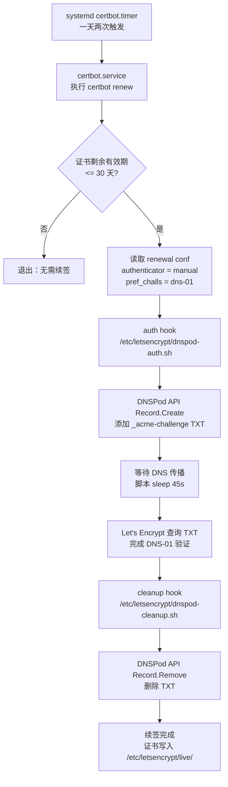

# Let's Encrypt 续签机制运维文档

## 现状速览

本项目后端域名 `api.order-audit-system-neo-brutalism.icu` 的 Let's Encrypt 证书续签已经在 `2026-05-01` 从 HTTP-01 迁移到 DNS-01。当前由 `systemd` 的 `certbot.timer` 一天两次触发 `certbot renew`；当证书剩余有效期小于等于 30 天时，certbot 使用 `manual` authenticator 调用自定义 DNSPod hook，在 DNSPod 添加 `_acme-challenge` TXT 记录，Let's Encrypt 验证通过后再调用 cleanup hook 删除 TXT 记录。这个机制不依赖 80 端口入站访问、nginx webroot 或 `/var/www/certbot` 目录。

## 架构流程图



## 关键文件清单

| 路径 | 用途 | 是否可删 | 修改风险 |
| --- | --- | --- | --- |
| `/etc/letsencrypt/dnspod.ini` | DNSPod API 凭证，权限应为 `chmod 600`，仅 root 可读；不进入 git | 不可删 | 凭证错误会导致 auth hook 无法调用 DNSPod API |
| `/etc/letsencrypt/dnspod-auth.sh` | certbot manual auth hook；添加 `_acme-challenge` TXT 记录并暂存 `record_id` | 不可删 | 脚本语法、权限或域名拆分错误会导致续签失败 |
| `/etc/letsencrypt/dnspod-cleanup.sh` | certbot manual cleanup hook；读取 `record_id` 并删除 TXT 记录 | 不可删 | 删除失败通常不阻断证书签发，但会留下过期 TXT 记录 |
| `/etc/letsencrypt/renewal/api.order-audit-system-neo-brutalism.icu.conf` | certbot 续签配置，指定 `manual` authenticator 和 hook 路径 | 不可删 | 配置错会让 certbot 改用错误验证方式或找不到 hook |
| `/var/lib/letsencrypt-dnspod/` | auth hook 写入、cleanup hook 读取的 `record_id` 临时存储目录 | 不建议手动删 | 续签过程中删除会导致 cleanup 找不到 `record_id`，可能残留 TXT |
| `/var/log/letsencrypt/dnspod-hook.log` | 自定义 hook 执行日志，记录 DNSPod API 返回、创建/删除记录过程 | 可轮转，不建议直接删 | 排障时会缺少 hook 层证据 |
| `/etc/nginx/conf.d/api.conf` | nginx 业务配置；80 端口仍保留 HTTP-01 的 `acme-challenge` location 作应急 | 不可删 | 影响 API 入口；误改 80 location 会影响 HTTP-01 回退 |
| `/etc/nginx/conf.d/default-catchall.conf` | nginx 防 IP 扫描兜底，未匹配域名返回 `444` | 不建议删 | 删除后会暴露默认站点行为，增加扫描噪音 |

当前 renewal conf 的关键参数：

```ini
authenticator = manual
pref_challs = dns-01,
manual_auth_hook = /etc/letsencrypt/dnspod-auth.sh
manual_cleanup_hook = /etc/letsencrypt/dnspod-cleanup.sh
manual_public_ip_logging_ok = True
```

## 如何手动验证续签

在服务器上执行：

```bash
sudo certbot renew --dry-run
```

预期成功标志是输出末尾出现：

```text
Congratulations, all simulated renewals succeeded
```

执行过程中可能出现类似：

```text
Hook ran with error output:
```

这句话在本项目里通常不是错误。certbot 的这段文案真实含义是“hook 曾经向 stderr 写过内容”。当前 hook 的 `log()` 函数会通过 `tee -a "$LOG_FILE" >&2` 主动把日志写到 stderr，便于在 certbot 输出里同步看到 hook 进度。因此判断是否成功应以 certbot 最终结果、DNSPod API `status.code`、以及 hook 日志中的 `ERROR` 或 `WARN` 为准。

如果需要观察完整过程，可以同时开另一个终端查看 hook 日志：

```bash
sudo tail -f /var/log/letsencrypt/dnspod-hook.log
```

## 如何查看日志

`/var/log/letsencrypt/dnspod-hook.log`

记录自定义 DNSPod hook 的日志，包括添加 TXT、DNSPod API 返回异常、暂存 `record_id`、删除 TXT 等。排查 DNSPod API、脚本权限、TXT 清理问题时先看这里。

```bash
sudo tail -n 200 /var/log/letsencrypt/dnspod-hook.log
```

`/var/log/letsencrypt/letsencrypt.log`

certbot 主日志，记录 renewal conf 读取、ACME 请求、验证失败原因、证书写入等。排查 Let's Encrypt 返回的 `NXDOMAIN`、`no TXT records found`、账号或 ACME 协议错误时看这里。

```bash
sudo tail -n 200 /var/log/letsencrypt/letsencrypt.log
```

`journalctl -u certbot.service`

systemd 触发的 certbot 执行记录。排查 timer 是否真正拉起 certbot、最近一次自动运行时间、服务退出码时看这里。

```bash
sudo journalctl -u certbot.service --since "24 hours ago" --no-pager
```

也可以检查 timer 状态：

```bash
systemctl status certbot.timer
systemctl list-timers certbot.timer
```

## 常见故障排查

### DNSPod API 凭证过期或 Token 被禁用

症状 → `certbot renew --dry-run` 失败；`/var/log/letsencrypt/dnspod-hook.log` 中 `Record.Create failed`，DNSPod 返回的 `status.code` 不是 `"1"`。

可能原因 → `/etc/letsencrypt/dnspod.ini` 中的 `DNSPOD_ID` 或 `DNSPOD_TOKEN` 已过期、被删除、被禁用，或权限不足。

验证命令 →

```bash
sudo tail -n 100 /var/log/letsencrypt/dnspod-hook.log
sudo grep -E "Record.Create failed|status|ERROR" /var/log/letsencrypt/dnspod-hook.log
sudo ls -l /etc/letsencrypt/dnspod.ini
```

修复步骤 → 登录 DNSPod 控制台重新创建 API Token，更新 `/etc/letsencrypt/dnspod.ini`，确认权限为 `600`，再执行 `sudo certbot renew --dry-run`。

### DNS 传播超时

症状 → auth hook 日志显示 TXT 已创建并 `Auth hook done.`，但 certbot 主日志或命令输出报 `DNS problem: NXDOMAIN`、`no TXT records found` 或类似 TXT 查询失败。

可能原因 → DNSPod 记录创建成功，但 Let's Encrypt 验证节点查询时还没有拿到新 TXT；也可能是本地递归 DNS 缓存、权威 DNS 传播延迟，或 TXT 记录添加到了错误子域。

验证命令 →

```bash
sudo tail -n 100 /var/log/letsencrypt/dnspod-hook.log
sudo tail -n 200 /var/log/letsencrypt/letsencrypt.log
dig TXT _acme-challenge.api.order-audit-system-neo-brutalism.icu +short
dig TXT _acme-challenge.api.order-audit-system-neo-brutalism.icu @1.1.1.1 +short
dig TXT _acme-challenge.api.order-audit-system-neo-brutalism.icu @8.8.8.8 +short
```

修复步骤 → 先重跑一次 `sudo certbot renew --dry-run`。如果反复失败，检查 auth hook 中 `ROOT_DOMAIN` 和 `SUB_RECORD` 计算结果；必要时把 auth hook 的等待时间从 `45s` 临时加长后再测试，确认后同步更新仓库 reference。

### hook 脚本权限被改导致 certbot 调不起来

症状 → certbot 输出 `Permission denied`、`No such file or directory`、`manual-auth-hook command ... returned error code`，hook 日志没有新记录。

可能原因 → `/etc/letsencrypt/dnspod-auth.sh` 或 `/etc/letsencrypt/dnspod-cleanup.sh` 不可执行、路径被改、换行符被改成 Windows CRLF，或 shebang 不可用。

验证命令 →

```bash
sudo ls -l /etc/letsencrypt/dnspod-auth.sh /etc/letsencrypt/dnspod-cleanup.sh
sudo head -n 1 /etc/letsencrypt/dnspod-auth.sh
sudo head -n 1 /etc/letsencrypt/dnspod-cleanup.sh
sudo tail -n 100 /var/log/letsencrypt/letsencrypt.log
```

修复步骤 → 恢复脚本可执行权限，确认属主和换行符，然后 dry-run 验证。

```bash
sudo chmod 700 /etc/letsencrypt/dnspod-auth.sh /etc/letsencrypt/dnspod-cleanup.sh
sudo sed -i 's/\r$//' /etc/letsencrypt/dnspod-auth.sh /etc/letsencrypt/dnspod-cleanup.sh
sudo certbot renew --dry-run
```

如果服务器已安装 `dos2unix`，也可以用下面的命令替代 `sed` 清理 CRLF；该工具需要先 `apt install dos2unix`。

```bash
sudo dos2unix /etc/letsencrypt/dnspod-auth.sh /etc/letsencrypt/dnspod-cleanup.sh
```

### certbot.timer 被禁用

症状 → 证书接近过期但没有自动续签；`systemctl status certbot.timer` 不是 `active`，`systemctl list-timers certbot.timer` 看不到下次执行时间。

可能原因 → 系统升级、误操作或清理服务时禁用了 `certbot.timer`。

验证命令 →

```bash
systemctl status certbot.timer
systemctl list-timers certbot.timer
sudo journalctl -u certbot.service --since "7 days ago" --no-pager
```

修复步骤 → 重新启用并立即检查 timer。

```bash
sudo systemctl enable --now certbot.timer
systemctl list-timers certbot.timer
sudo certbot renew --dry-run
```

### DNSPod API 限流

症状 → 短时间内多次 `certbot renew --dry-run` 后失败；hook 日志中 `Record.Create failed` 或 `Record.Remove failed`，DNSPod 返回限流、频率过高或类似提示。

可能原因 → 连续手动测试、自动 timer 与手动 dry-run 重叠，或 cleanup 删除失败后反复重试。

验证命令 →

```bash
sudo tail -n 200 /var/log/letsencrypt/dnspod-hook.log
systemctl list-timers certbot.timer
ps aux | grep '[c]ertbot'
```

修复步骤 → 停止重复执行，等待 DNSPod 限流窗口恢复；确认没有多个 certbot 进程并发运行后再执行一次 dry-run。如果留下多余 TXT 记录，可在 DNSPod 控制台手动删除旧的 `_acme-challenge` TXT 记录；删除前先确认它们不是当前正在进行的 dry-run 创建的（dry-run 期间会临时存在合法 TXT，约 1 分钟自动清理）。

## 应急回退到 HTTP-01

服务器上 nginx 80 端口的 HTTP-01 通道仍保留在 `/etc/nginx/conf.d/api.conf`：

```nginx
location /.well-known/acme-challenge/ {
    root /var/www/certbot;
}
```

回退只建议在 DNSPod API 长时间不可用、且必须续签证书时临时使用。未备案 `.icu` 域名部署在国内 ECS 时，HTTP-01 可能被 Let's Encrypt 境外验证节点访问链路上的网络层拦截并返回 `403`，因此它不是当前推荐方案。

临时回退步骤：

1. 备份当前 renewal conf。

```bash
sudo cp /etc/letsencrypt/renewal/api.order-audit-system-neo-brutalism.icu.conf \
  /etc/letsencrypt/renewal/api.order-audit-system-neo-brutalism.icu.conf.bak.$(date +%F-%H%M%S)
```

2. 编辑 renewal conf。

```bash
sudo nano /etc/letsencrypt/renewal/api.order-audit-system-neo-brutalism.icu.conf
```

3. 在 `[renewalparams]` 中把验证方式改回 webroot。

```ini
authenticator = webroot
webroot_path = /var/www/certbot,
```

同时删除或注释掉：

```ini
manual_auth_hook = /etc/letsencrypt/dnspod-auth.sh
manual_cleanup_hook = /etc/letsencrypt/dnspod-cleanup.sh
manual_public_ip_logging_ok = True
```

4. 确认 nginx 80 端口和 webroot 可用。

```bash
sudo nginx -t
sudo systemctl reload nginx
sudo mkdir -p /var/www/certbot/.well-known/acme-challenge
echo ok | sudo tee /var/www/certbot/.well-known/acme-challenge/ping.txt
curl -i http://api.order-audit-system-neo-brutalism.icu/.well-known/acme-challenge/ping.txt
```

5. 执行 dry-run。

```bash
sudo certbot renew --dry-run
```

回退完成后，应尽快恢复 DNS-01 renewal conf，并再次执行 dry-run 验证。

## DNSPod Token 轮换流程

1. 登录 DNSPod API Token 控制台：

```text
https://console.dnspod.cn/account/token/apikey
```

2. 创建新的 API Token，记录新的 ID 和 Token。不要把它们写入仓库、聊天记录或工单。

3. 在服务器上编辑凭证文件。

```bash
sudo nano /etc/letsencrypt/dnspod.ini
```

文件中只保留两行变量，值使用新 token：

```bash
DNSPOD_ID=...
DNSPOD_TOKEN=...
```

4. 确认权限。

```bash
sudo chmod 600 /etc/letsencrypt/dnspod.ini
sudo chown root:root /etc/letsencrypt/dnspod.ini
```

5. 执行验证。

```bash
sudo certbot renew --dry-run
```

6. dry-run 验证通过后，在 DNSPod 控制台删除旧 token。先验证新 token 再删除旧 token，可以避免新旧 token 都不可用的窗口期。

无需重启 nginx、certbot timer 或后端服务。下一次 `certbot renew` 会重新读取 `/etc/letsencrypt/dnspod.ini`。

## 历史决策记录

`2026-05-01` 从 HTTP-01 切到 DNS-01，是因为 Let's Encrypt Multi-Perspective Validation 的部分境外验证节点访问国内未备案 `.icu` 域名时，被阿里云链路上的网络层拦截并返回 `403`，导致 HTTP-01 不可靠。没有使用第三方 `certbot-dns-dnspod` 插件，是因为 apt 安装的 certbot 与 pip 安装插件容易出现 Python 路径和依赖冲突；manual hook 只依赖系统已有的 bash、curl、python3，维护面更小。hook 脚本里硬编码 `ROOT_DOMAIN="order-audit-system-neo-brutalism.icu"`，是为了避免动态拆分域名时遇到 `.com.cn` 这类多级 TLD 产生歧义；本项目当前只维护这一个主域名。
